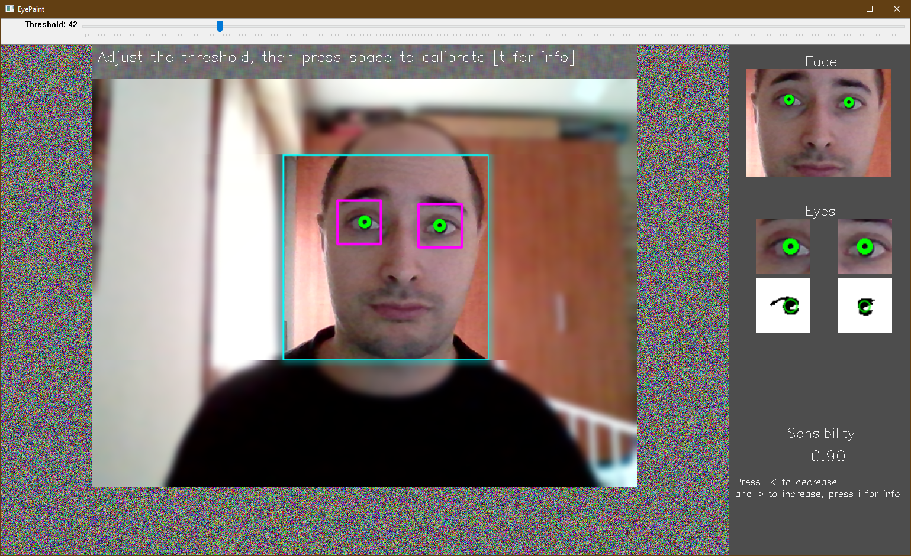
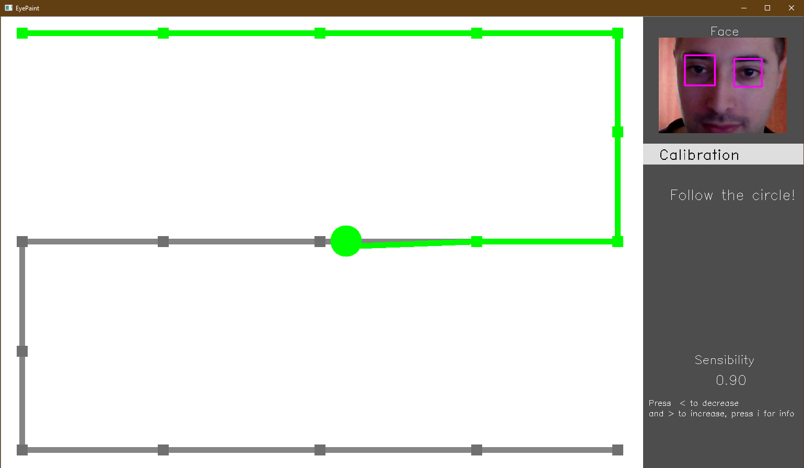
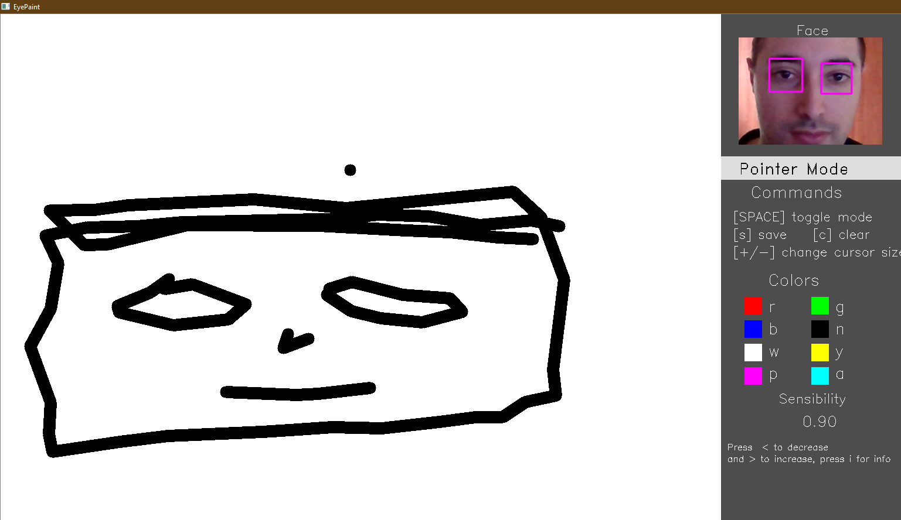

# EyeDraw
Small computer vision software that allows you to draw with your own eyes

***


Table of contents

## Basic Overview
This project aims to investigate the potential of computer vision in eyes detection for the development of a real-time application with the use of a simple webcam. **OpenCV** is used for both the GUI and the algorithmic part. 

The execution consists of 3 phases:

| 1. Threshold Settings                                        | 2. Calibration                                               | 3. Draw                                                      |
| ------------------------------------------------------------ | ------------------------------------------------------------ | ------------------------------------------------------------ |
|               |             |                   |
| Your face and eyes are detected in real-time. You must set two important threshold to improve and stabilize the detection. | The calibration is performed making you follow the circle with your eyes for about 30 seconds. | You can draw! Move the cursor on the canvas and draw what you want. Custom options and colors are available. |

**Language**: *Python*

**Frameworks**: *OpenCV*

**Algorithms**: *Haar cascade classifier*, *Blob Detection* , *Homography*

# Prerequisiti

# How to execute it

# Projects structure vedi https://github.com/supunlakmal/thismypc#readme


# How it works
1 
2
3

# GUI explination

#related

-------------

## Table of contents
* [General info](#general-info)
* [Technologies](#technologies)
* [Setup](#setup)

## General info
This project is simple Lorem ipsum dolor generator.
	
## Technologies
Project is created with:
* Lorem version: 12.3
* Ipsum version: 2.33
* Ament library version: 999
	
## Setup
To run this project, install it locally using npm:

```
$ cd ../lorem
$ npm install
$ npm start
```