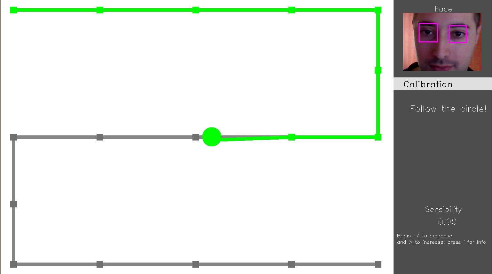

# EyeDraw
Small computer vision software that allows you to **draw with your eyes**.

<div align="center">
     
</div>


***

## Table of contents

* [Basic Overview](#basic-overview)
* [Project structure](#project-structure)
* [System Requirements](#system-requirements)
* [Setup](#setup)
* [How it works](#how-it-works)
* [References](#references)

## Basic Overview
This project aims to investigate the potential of computer vision in *eye detection* for the development of a *real-time* application with the use of a simple webcam. **OpenCV** is used for both the GUI and the algorithmic part. I also made a more detailed guide<sup>[[1]](#eyedraw_ref)</sup>.

The execution consists of 3 phases:

| 1. Threshold Settings                                        | 2. Calibration                                               | 3. Draw                                                      |
| ------------------------------------------------------------ | ------------------------------------------------------------ | ------------------------------------------------------------ |
|          |        |              |
| The software detects your face and eyes in real time. Two important thresholds must be set to improve the detection. | Calibration is done by asking you to follow a green circle with your eyes for about 30 seconds. | You can draw! Move the cursor over the canvas and draw what you want. Custom colors and options are available. |

**Language**: *Python*

**Frameworks**: *OpenCV*

**Algorithms**: *Haar cascade classifier*, *Blob Detection* , *Homography*

## Project structure

```
project
│   README.md
│   LICENSE
|   environment.yml	Anaconda's environment configuration file
│
└───imgs
│   │   1.threshold.png
│   │   2.calibration.png
│   │   3.paint.png
│   │   ...
│	
│   main.py		Main file to execute the software
│   Detector.py		Class for face and eye detection			
│   Homography.py	Class for calculation of the homography map
│   GUI.py		Class for the drawing and rendering of the user interface 			
```

## System Requirements

- **Python 3.8**

- **Numpy 1.19.2**

- **OpenCV 4.0.1** 

  - Be sure  that OpenCV's *haarcascade* models '*haarcascade_frontalface_default.xml*' and '*haarcascade_eye.xml*' are properly installed in OpenCV root folder in your Python environment. 

    Files should be in the path returned by this snippet:

    ```python
    >>> import cv2
    >>> from os.path import realpath, normpath
    >>> normpath(realpath(cv2.__file__) + '../../../../Library/etc/haarcascades/')
    ```

    If the path doesn't exist, find the right folder containing the cascade xml files and change the path in line 7 of `Detector.py` file. 

If you use [Anaconda] you can use my same environment using the `environment.yml` file, running the command

[Anaconda]: https://www.anaconda.com/

```bash
conda env create -f environment.yml
```

and the environment will get installed in your default conda environment path.

## Setup

To run the project, clone it with [Git] and run the `main.py` file:

[Git]: https://git-scm.com/downloads	"Git download page"

```
$ git clone https://github.com/fabridigua/EyeDraw
$ cd EyeDraw
$ python main.py
```

## How it works
1. **Eye Detection** and **Threshold Settings**

   During all the execution the software analyze the input image from the webcam to detect the face and in particular the eyes

   Face and eyes detection is made with OpenCV's **[Haar Cascade Detector]**<sup>[[2]](#haar_ref)</sup>  and then to detect the pupils, a **Blob Detection**<sup>[[3]](#blob_ref)</sup>   is made with the **[SimpleBlobDetector]**.

   [Haar Cascade Detector]: https://docs.opencv.org/3.4/db/d28/tutorial_cascade_classifier.html	"Haar Cascade Detector Explanation"
   [SimpleBlobDetector]:  https://docs.opencv.org/4.0.1/d0/d7a/classcv_1_1SimpleBlobDetector.html#details "cv::SimpleBlobDetector Class Reference"

   In this phase is necessary to set two specific threshold:

   - **Eye Detection Threshold**: value used during the pupils detection inside the eyes to decide how intense the thresholding of the eye image has to be. it should be chosen based on the stability of the pupils detection (the green circle drawn inside the eyes). The best value could depend on the lighting conditions and the webcam. The value cannot be changed in later phases. 

     |  |  |  |
     | ---------------------------- | --------------------------- | ---------------------------- |
     | Good threshold value         | Too Low threshold value     | Too High threshold value     |

     

   - **Sensibility**: value used to determine if the eyes have moved in two consecutive frames. To stabilize the detected eye position (and therefore the cursor position during the drawing phase), the current eye position is updated only if the two bounding boxes (the fuchsia squares) of the same eye in the two observed frames overlap less than a certain percentage, given by the *sensibility* value. 

     |  |  |  |
     | --------------------------------- | -------------------------------- | --------------------------------- |
     | Good sensitivity level            | Too low sensitivity level        | Too high sensitivity level        |

2. **Calibration**

   The user has to follow a filled circle moving on the screen for about 30 seconds. If the software is detecting the eyes the circle is green, otherwise it turns red and stops its movement until the eyes are seen again. There are 17 known positions on the path where the circle stops the walk and the software saves both the position of the circle and that of the eye; for the eye the horizontal midpoint is considered.  At the end of the calibration the software calculates the [homography] between the screen and the one built with the saved eye positions.

   <center>
       <div align="center">        
            
           <p>Calibration Process</p>
       </div>
   </center>
   
3. **Drawing**

   The user can draw! There are two interaction modes, which can be activated with the `space` key: the "*Pointer Mode*" in witch the user can move the cursor in the canvas without drawing and the "*Paint Mode*" in which the user can draw by moving the eyes on the canvas. At any time the user can:

   - Change the interaction mode with `space` key
   - Clean the canvas with `c` key
   - Change the cursor size with `-` key to decrease and `+` to increase 
   - Save the image with `s` key
   - Change the *sensibility* value with `<` key to decrease and `>` to increase
   - Change the color by choosing from those showed in the palette in the sidebar

   <center>
       <div align="center">
            
           <p>Some drawing functionalities</p>
       </div>
   </center>
   
   

## References

<a name="eyedraw_ref">[1]</a>:  [EyeDraw — How to draw with your eyes using Computer Vision]

[EyeDraw — How to draw with your eyes using Computer Vision]: https://fabridigua.medium.com/eyedraw-how-to-draw-with-your-eyes-using-computer-vision-226317501e6a	"EyeDraw — How to draw with your eyes using Computer Vision"

<a name="haar_ref">[2]</a>: WILSON, Phillip Ian; FERNANDEZ, John. Facial feature detection using Haar classifiers. *Journal of Computing Sciences in Colleges*, 2006, 21.4: 127-133.

<a name="haar_ref">[3]</a>:  [Detecting objects using Haar Cascade Classifier]

[Detecting objects using Haar Cascade Classifier]: https://towardsdatascience.com/computer-vision-detecting-objects-using-haar-cascade-classifier-4585472829a9	"Detecting objects using Haar Cascade Classifier"

<a name="blob_ref">[4]</a>:  [Blob Detection]

[Blob Detection]: https://medium.com/image-processing-in-robotics/blob-detection-309226a3ea5b	"Blob Detection"

<a name="homo_ref">[5]</a>:  [Homography - And how to calculate it?]

[Homography - And how to calculate it?]: https://medium.com/all-things-about-robotics-and-computer-vision/homography-and-how-to-calculate-it-8abf3a13ddc5	"Homography - And how to calculate it?"

<a name="dlib_ref">[6]</a>:  [Real-time eye tracking using OpenCV and Dlib]

[Real-time eye tracking using OpenCV and Dlib]: https://towardsdatascience.com/real-time-eye-tracking-using-opencv-and-dlib-b504ca724ac6	"Real-time eye tracking using OpenCV and Dlib"

