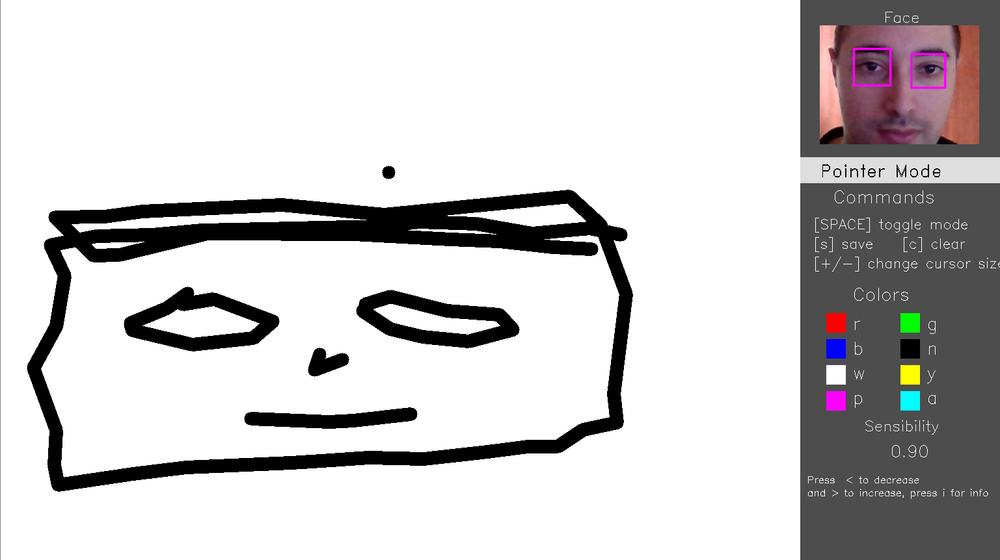

# EyeDraw
Small computer vision software that allows you to draw with your own eyes

***

Preview GIF {TODO}

Table of contents {TODO}

## Basic Overview
This project aims to investigate the potential of computer vision in eyes detection for the development of a real-time application with the use of a simple webcam. **OpenCV** is used for both the GUI and the algorithmic part. 

The execution consists of 3 phases:

| 1. Threshold Settings                                        | 2. Calibration                                               | 3. Draw                                                      |
| ------------------------------------------------------------ | ------------------------------------------------------------ | ------------------------------------------------------------ |
|          |        |              |
| Your face and eyes are detected in real-time. You must set two important threshold to improve and stabilize the detection. | The calibration is performed making you follow the circle with your eyes for about 30 seconds. | You can draw! Move the cursor on the canvas and draw what you want. Custom options and colors are available. |

**Language**: *Python*

**Frameworks**: *OpenCV*

**Algorithms**: *Haar cascade classifier*, *Blob Detection* , *Homography*

## System Requirements

- **Python 3.8**

- **OpenCV 4.0.1** 

  - Be sure  that OpenCV's haarcascade models '*haarcascade_frontalface_default.xml*' and '*haarcascade_eye.xml*' are properly installed in OpenCV root folder in your Python environment. 

    Files should be in the path returned by this snippet:

    ```python
    >>> import cv2
    >>> from os.path import realpath, normpath
    >>> normpath(realpath(cv2.__file__) + '../../../../Library/etc/haarcascades/')
    ```

    If the path doesn't exist, find the right folder containing the cascade xml filles and change the path in line 7 of `Detector.py` file. 

## Projects structure

```
project
│   README.md
│   LICENSE   
│
└───imgs
│   │   1.threshold.png
│   │   2.calibration.png
│   │   3.paint.png
│
│   main.py		Main file to execute the software
│   Detector.py		Class for face and eye detection			
│   Homography.py	Class for calculation of the homography map
│   GUI.py		Class for the drawing and rendering of the user interface 			
```


## How it works
1. **Eye Detection** and **Threshold Settings**

   During all the execution the software analyze the input image from the webcam to detect the face and in particular the eyes.

   Face and eyes detection is made with OpenCV's [Haar Cascade Detector] and then to detect the pupils, a Blob Detection is made with the [SimpleBlobDetector].

   [Haar Cascade Detector]: https://docs.opencv.org/3.4/db/d28/tutorial_cascade_classifier.html	"Haar Cascade Detector Explanation"
   [SimpleBlobDetector]:  https://docs.opencv.org/4.0.1/d0/d7a/classcv_1_1SimpleBlobDetector.html#details "cv::SimpleBlobDetector Class Reference"

   In this phase is necessary to set two specific threshold:

   - **Eye Detection Threshold**: value used during the pupils detection inside the eyes to decide how intense the thresholding of the eye image has to be. it should be chosen basing on the stability of the pupils detection (the green circle drawn inside the eyes). The best value could depend on the light condition and the webcam. The value can't be changed in the next phases. 

     |  |  |  |
     | ------------------------------------------------------- | ------------------------------------------------------ | ------------------------------------------------------- |
     | Good threshold value                                    | Too Low threshold value                                | Too High threshold value                                |

   - **Sensibility**: value used to determine if the eyes have moved in two consecutive frames. To stabilize the detected eye position (and so the cursor position during the drawing phase), the current eye position is updated only if the two bounding box of the same eye in the two observed frames overlap less than a certain percentage, given by the *sensibility* value.

2. Calibration

3. Drawing


# GUI Explanation

#related

-------------

## Table of contents
* [General info](#general-info)
* [Technologies](#technologies)
* [Setup](#setup)

## General info
This project is simple Lorem ipsum dolor generator.
	
## Technologies
Project is created with:
* Lorem version: 12.3
* Ipsum version: 2.33
* Ament library version: 999
	
## Setup
To run this project, install it locally using npm:

```
$ cd ../lorem
$ npm install
$ npm start
```